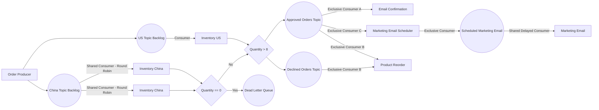
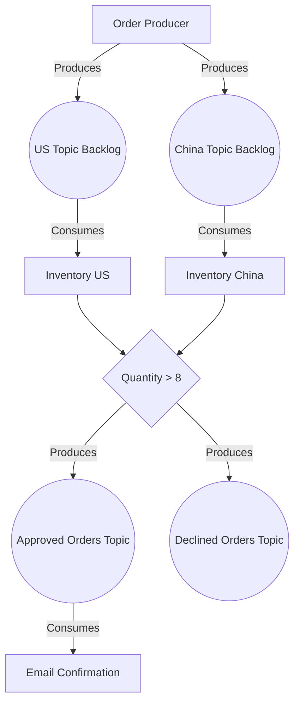

# Developer Training

Struct

```mermaid
graph LR;
    OrderProducer[Order Producer] -->  BackLogChina((China Topic Backlog))
    OrderProducer[Order Producer] -->  BackLogUS((US Topic Backlog))

    BackLogChina((China Topic Backlog)) --> |Shared Consumer - Round Robin| InventoryChinaA[Inventory China]
    BackLogChina((China Topic Backlog)) --> |Shared Consumer - Round Robin| InventoryChinaB[Inventory China]
    BackLogUS((US Topic Backlog)) --> |Consumer| InventoryUS[Inventory US]

    InventoryUS --> isBiggerThan8{Quantity > 8}

    InventoryChinaA --> isInvalid{Quantity == 0}
    InventoryChinaB --> isInvalid
    
    isInvalid --> |No| isBiggerThan8
    isInvalid --> |Yes| DLQ((Dead Letter Queue))

    isBiggerThan8 --> Approved((Approved Orders Topic))
    isBiggerThan8 --> Declined((Declined Orders Topic))

    Approved --> |Exclusive Consumer A| EmailConfirmation[Email Confirmation]
    Approved --> |Exclusive Consumer C| MarketingEmailScheduler[Marketing Email Scheduler ]

    Approved --> |Exclusive Consumer B| ProductReorder[Product Reorder]
    Declined --> |Exclusive Consumer B| ProductReorder[Product Reorder]
    MarketingEmailScheduler -->|Exclusive Consumer| ScheduledMarketingEmail((Scheduled Marketing Email))
    ScheduledMarketingEmail -->|Shared Delayed Consumer| MarketingEmail[Marketing Email]
```

String

```mermaid
graph TD;
    OrderProducer[Order Producer] --> |Produces| BackLogChina((China Topic Backlog))
    OrderProducer[Order Producer] --> |Produces| BackLogUS((US Topic Backlog))

    BackLogChina((China Topic Backlog)) --> |Consumes| InventoryChina[Inventory China]
    BackLogUS((US Topic Backlog)) --> |Consumes| InventoryUS[Inventory US]

    InventoryUS --> isbiggerThan8{Quantity > 8}
    InventoryChina --> isbiggerThan8

    isbiggerThan8 --> |Produces| Approved((Approved Orders Topic))
    isbiggerThan8 --> |Produces| Declined((Declined Orders Topic))

    Approved -->|Consumes| EmailConfirmation[Email Confirmation]

```

